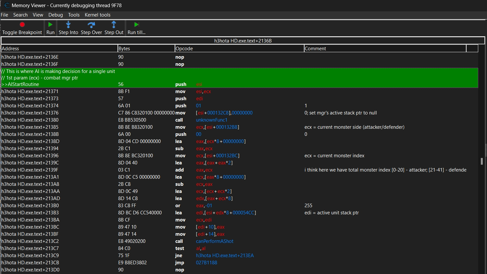
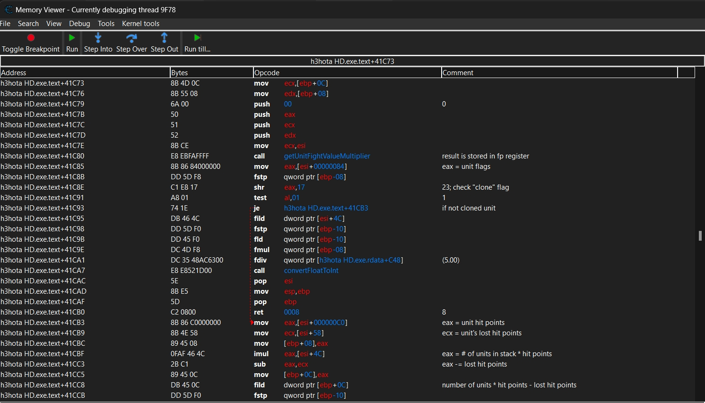

# HotaSim - Heroes 3: Horn of the Abyss battle simulator

## Overview

This project aims to provide tool for simulating battles between real player and AI and giving the best possible outcome.
The main goal was to be possible to simulate encounter battles ie. crypts, conservatories, etc.

I worked on this project few years ago and decided to publish it on GitHub just now.
Current state of the project allows to simulate battles between simplest melee creatures, without any additional abilities.
I do not plan to continue working on this project in the near future.

Project is written in C++ and is splitted in two parts:
- HotaMechanics - library that reimplements HotA battle mechanics (based on Hota v1.6.1); code here should be quite readable and understandable
- HotaSim - application that uses HotaMechanics to simulate battles for optimal outcome; code here is quite messy and buggy

Project also contains Cheat Engine's table with some useful addresses and comments in disassembly code. This part was added later and cheat tables are based on HotA v1.7.1.

There are some polish comments in the code, mostly about AI battle logic flow and some other things.

## Features

- Reimplemented some HotA mechanics and battle logic based on HotA v1.6.1 actual code (i did some reverse engineering for that part)
- Simulation of battles between two armies of simplest possible creatures (not-wide, melee, without abilities)
- Optimization of battle outcome for player side (more of a try)

## Reverse Engineering

If anyone is interested in reverse engineering (basic CheatEngine knowledge required) HotA battle AI by themselves with provided cheat tables i would recommend to:
- prepare custom map with two armies of simplest creatures (eg. peasants, imps)
- start HotA and attach Cheat Engine to the process
- start battle
- go to `AIStartRoutine` address in Cheat Engine and set breakpoint
- just step through the code and see what happens

I made a comments for what i was able to understand in the disassembly code and also tried to put meaningful names for some functions and data structures.
Code part (HotaMechanics) goes a bit further than cheat tables as the latter were added later, but both should give you a good start.

[This repo](https://github.com/RoseKavalier/H3API) will be also your friend, as you can find there a lot of useful data structures so you don't have to decode each offset by yourself.

These are examples of what comments you can find in the disassembly code:




I have also used Ghidra's decomplier for some functions, to understand them better, which i also recommend.

## Build and run

You can set up hero and armies in `HotaSim/HotaSim.cpp` file and just run the application in the most recent Visual Studio version.

Program will perform battle by simulating player and AI moves and at the end it will "replay" the best possible outcome for player side (this part is bugged).

## Code statistics (via [gocloc](https://github.com/hhatto/gocloc))

```console
$> gocloc /exclude-ext "json,txt" /not-match-d "packages*" .
-------------------------------------------------------------------------------
Language                     files          blank        comment           code
-------------------------------------------------------------------------------
C++                             35           1259            494           4114
C Header                        20            425            585           1048
Markdown                         1             20              0             46
-------------------------------------------------------------------------------
TOTAL                           56           1704           1079           5208
-------------------------------------------------------------------------------
```